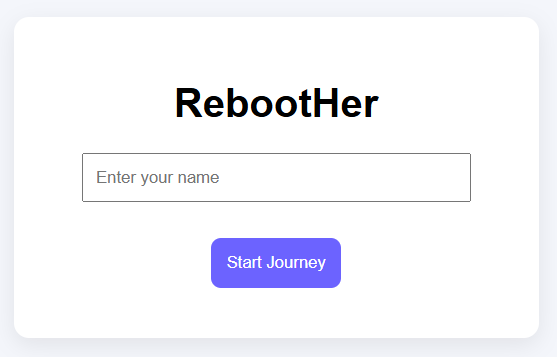
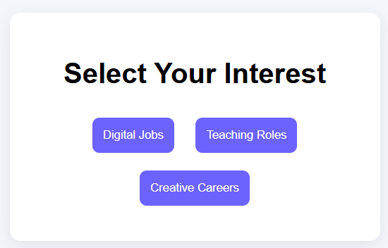
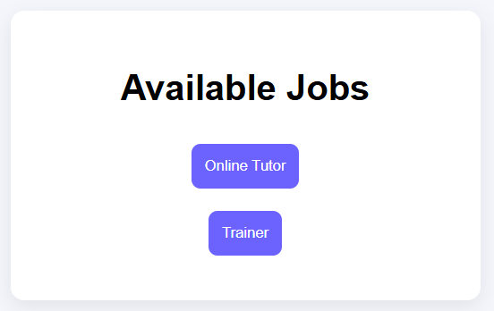
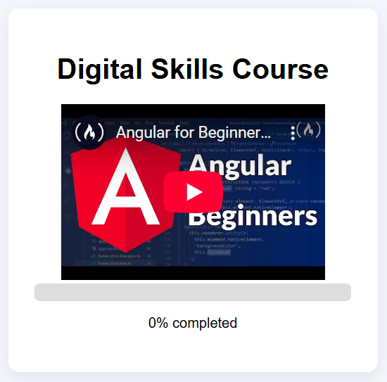

# 🌸 RebootHer – Career Comeback Platform

## 🧠 Problem Statement

Many women pause their careers due to marriage, maternity, caregiving, or relocation.  
Returning to the workforce later becomes difficult because of:

- Skill gaps
- Lack of confidence
- Limited guidance on current job opportunities
- Absence of structured learning pathways
- No support community for re-entry

RebootHer aims to solve this by providing a guided, supportive, and skill-driven pathway for women to restart their careers.

---

## 💡 Our Solution

RebootHer is a web platform that helps women:

- Discover suitable career paths through guided quizzes  
- Identify required skills and learning roadmaps  
- Improve resumes using AI suggestions  
- Learn through structured lessons and courses  
- Track learning progress visually  
- Access mentors and peer community support  

The platform focuses on **confidence building + structured action**, not just suggestions.

---

## ✨ Key Features

### 🔹 Career Guidance Flow
- Login and onboarding
- Career interest quiz
- Job suggestions based on interest
- Job success stories and re-entry pathways

### 🔹 Skill Development System
- Skill level assessment quiz
- Structured course modules
- Lesson progress tracking bar
- Practice and interview preparation

### 🔹 AI-Powered Resume Builder
- Resume text input
- AI suggestions for improvement
- Career gap friendly phrasing
- Skill highlighting support

### 🔹 Community Support
- Discussion posts from users
- Opportunity sharing
- Peer guidance for career restart

### 🔹 Mentor Support
- Access to role-specific mentors
- Career advice and guidance system

---

---

## 📸 Screenshots

### 🔐 Login Page

### 🧭 Career Quiz

### 💼 Job Suggestions

### 📚 Course Progress Tracking

---

## 🛠 Tech Stack

**Frontend**
- HTML
- CSS
- JavaScript

**Storage**
- LocalStorage (for MVP persistence)

**AI Integration**
- OpenAI API for resume improvement

---

## 🚀 How to Run the Project

1. Clone the repository
2. Open the project folder in VS Code
3. Right-click `login.html`
4. Open with **Live Server**
5. Start exploring the platform flow

---

## 🌍 Impact

RebootHer aims to:

- Increase women workforce participation
- Reduce confidence barriers to re-entry
- Provide structured learning support
- Enable peer mentorship ecosystems
- Support economic independence

---

## 🔮 Future Scope

- Employer partnerships for returnships
- Verified mentorship network
- Mobile application version
- AI career coach chatbot
- Skill-based job matching engine
- Government program integration

---

## 👩‍💻 Team {}

- Grace Mariyan Sabu
- Aayisha Muhammed

---

## ❤️ Built for

**TinkerHub TinkHerHack**

Empowering women to turn career breaks into breakthroughs.
